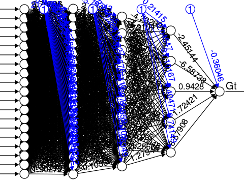
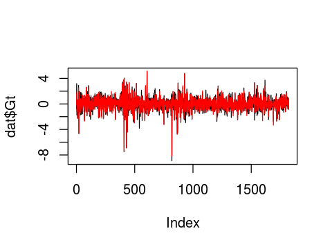
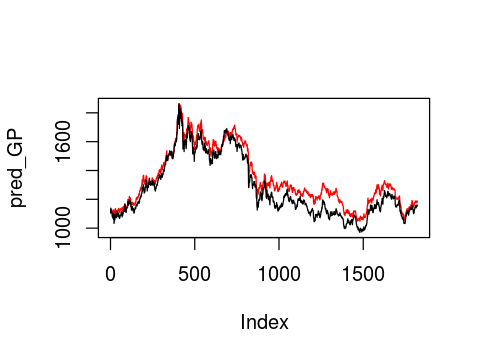

```R
library("AzureML")
ws <- workspace()
dat <- download.datasets(ws, "Roc2010_t4_omit0.csv")
```


```R
dat<-dat*100
head(dat)
```


<table>
<thead><tr><th scope=col>Ut</th><th scope=col>St</th><th scope=col>Ot</th><th scope=col>Ut1</th><th scope=col>St1</th><th scope=col>Ot1</th><th scope=col>Gt1</th><th scope=col>Ut2</th><th scope=col>St2</th><th scope=col>Ot2</th><th scope=col>Gt2</th><th scope=col>Ut3</th><th scope=col>St3</th><th scope=col>Ot3</th><th scope=col>Gt3</th><th scope=col>Ut4</th><th scope=col>St4</th><th scope=col>Ot4</th><th scope=col>Gt4</th><th scope=col>Gt</th></tr></thead>
<tbody>
	<tr><td> 0.58</td><td> 0.40</td><td>-0.63</td><td>-0.25</td><td> 0.05</td><td> 1.71</td><td> 0.51</td><td> 0.03</td><td> 0.31</td><td> 0.32</td><td>-0.02</td><td>-0.50</td><td>1.59 </td><td> 2.67</td><td> 1.09</td><td>-0.07</td><td>-1.01</td><td> 0.10</td><td> 0.81</td><td>-0.80</td></tr>
	<tr><td>-0.58</td><td> 0.29</td><td> 0.11</td><td> 0.58</td><td> 0.40</td><td>-0.63</td><td>-0.80</td><td>-0.25</td><td> 0.05</td><td> 1.71</td><td> 0.51</td><td> 0.03</td><td>0.31 </td><td> 0.32</td><td>-0.02</td><td>-0.50</td><td> 1.59</td><td> 2.67</td><td> 1.09</td><td> 3.18</td></tr>
	<tr><td>-0.64</td><td> 0.17</td><td>-0.28</td><td>-0.58</td><td> 0.29</td><td> 0.11</td><td> 3.18</td><td> 0.58</td><td> 0.40</td><td>-0.63</td><td>-0.80</td><td>-0.25</td><td>0.05 </td><td> 1.71</td><td> 0.51</td><td> 0.03</td><td> 0.31</td><td> 0.32</td><td>-0.02</td><td>-0.45</td></tr>
	<tr><td>-0.05</td><td>-0.94</td><td>-2.12</td><td>-0.64</td><td> 0.17</td><td>-0.28</td><td>-0.45</td><td>-0.58</td><td> 0.29</td><td> 0.11</td><td> 3.18</td><td> 0.58</td><td>0.40 </td><td>-0.63</td><td>-0.80</td><td>-0.25</td><td> 0.05</td><td> 1.71</td><td> 0.51</td><td>-1.75</td></tr>
	<tr><td>-0.17</td><td> 0.83</td><td>-1.42</td><td>-0.05</td><td>-0.94</td><td>-2.12</td><td>-1.75</td><td>-0.64</td><td> 0.17</td><td>-0.28</td><td>-0.45</td><td>-0.58</td><td>0.29 </td><td> 0.11</td><td> 3.18</td><td> 0.58</td><td> 0.40</td><td>-0.63</td><td>-0.80</td><td> 0.42</td></tr>
	<tr><td>-0.14</td><td> 0.24</td><td>-0.33</td><td>-0.17</td><td> 0.83</td><td>-1.42</td><td> 0.42</td><td>-0.05</td><td>-0.94</td><td>-2.12</td><td>-1.75</td><td>-0.64</td><td>0.17 </td><td>-0.28</td><td>-0.45</td><td>-0.58</td><td> 0.29</td><td> 0.11</td><td> 3.18</td><td>-0.48</td></tr>
</tbody>
</table>


```R
install.packages("neuralnet")
library(neuralnet) # for neuralnet(), nn model
```

    Installing package into '/home/nbcommon/R'
    (as 'lib' is unspecified)


    
    The downloaded source packages are in
    	'/tmp/RtmpV94KaQ/downloaded_packages'


```R
formula.bpn <- Gt ~ Ut + St + Ot + Ut1 + St1 + Ot1 + Gt1+ Ut2 + St2 + Ot2 + Gt2+ Ut3 + St3 + Ot3 + Gt3 + Ut4 + St4 + Ot4 + Gt4
start.time <- proc.time()
bpn <- neuralnet(formula = formula.bpn, 
                 data = dat,
                 hidden = c(20,10,5),       # 一個隱藏層：2個node
                 learningrate = 0.3, # learning rate
                 threshold = 0.5,    # partial derivatives of the error function, a stopping criteria
                 stepmax = 5e4 ,       # 最大的ieration數 = 500000(5*10^4)
)
end.time <-proc.time()
print(end.time-start.time)
```


```R
print(bpn)
plot.nn(bpn, rep="best")
```

    Call: neuralnet(formula = formula.bpn, data = dat, hidden = c(20, 10,     5), threshold = 0.5, stepmax = 50000, learningrate = 0.3)
    
    1 repetition was calculated.
    
            Error Reached Threshold Steps
    1 192.6916578      0.4930045272 12371
    





```R
pred <- compute(bpn, dat[,c(1:ncol(dat)-1)])  
head(pred$net.result)
```


<table>
<tbody>
	<tr><td>-0.0916248747</td></tr>
	<tr><td> 1.8139310773</td></tr>
	<tr><td>-0.0673695511</td></tr>
	<tr><td>-1.1422941928</td></tr>
	<tr><td> 0.3092976241</td></tr>
	<tr><td>-0.1315870592</td></tr>
</tbody>
</table>


```R
#預測及實際檔跌幅
max(pred$net.result)
max(dat$Gt)
min(pred$net.result)
min(dat$Gt)
plot(dat$Gt,type="l")
lines(pred$net.result,col="red")
```


5.15330477104723


5.07


-8.14296475400658


-8.91





```R
#將漲跌幅回推成黃金歷史牌價，黑色為訓練資料，紅色為預測資料
init_GP<-1113

for( i in c(1:length(pred$net.result)))
{
  if(i==1)  
  {
    pred_GP=c(init_GP+init_GP*(pred$net.result[i]/100))    
  }
  else
    pred_GP= c(pred_GP,pred_GP[i-1]+pred_GP[i-1]*(pred$net.result[i]/100))    
}

for( i in c(1:length(dat$Gt)))
{
  if(i==1)  
  {
    train_GP=c(init_GP+init_GP*(dat$Gt[i]/100))    
  }
  else
    train_GP= c(train_GP,train_GP[i-1]+train_GP[i-1]*(dat$Gt[i]/100))    
}
plot(pred_GP,ylim=c(min(min(pred_GP),min(train_GP)),max(max(pred_GP),max(train_GP))),type="l",col="red")
lines(train_GP)
```




