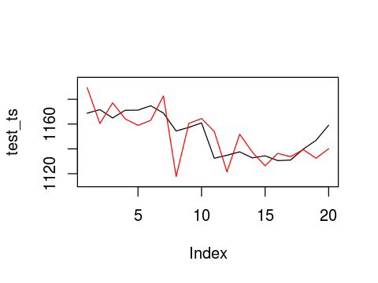

```R
library("AzureML")
ws <- workspace()
traindataset <- download.datasets(ws, "Roc2010_Train_Dataset.csv")
traindataset<-traindataset*100
testdataset <- download.datasets(ws, "Roc2010_Test_Dataset.csv")
testdataset<-testdataset*100
myLondanGold<-download.datasets(ws, "myLondanGold_xts.csv")
```


```R
head(traindataset)
head(testdataset)
tail(myLondanGold)
```


<table>
<thead><tr><th scope=col>Ut</th><th scope=col>St</th><th scope=col>Ot</th><th scope=col>Ut1</th><th scope=col>St1</th><th scope=col>Ot1</th><th scope=col>Gt1</th><th scope=col>Ut2</th><th scope=col>St2</th><th scope=col>Ot2</th><th scope=col>Gt2</th><th scope=col>Ut3</th><th scope=col>St3</th><th scope=col>Ot3</th><th scope=col>Gt3</th><th scope=col>Ut4</th><th scope=col>St4</th><th scope=col>Ot4</th><th scope=col>Gt4</th><th scope=col>Gt</th></tr></thead>
<tbody>
	<tr><td> 0.58</td><td> 0.40</td><td>-0.63</td><td>-0.25</td><td> 0.05</td><td> 1.71</td><td> 0.51</td><td> 0.03</td><td> 0.31</td><td> 0.32</td><td>-0.02</td><td>-0.50</td><td>1.59 </td><td> 2.67</td><td> 1.09</td><td>-0.07</td><td>-1.01</td><td> 0.10</td><td> 0.81</td><td>-0.80</td></tr>
	<tr><td>-0.58</td><td> 0.29</td><td> 0.11</td><td> 0.58</td><td> 0.40</td><td>-0.63</td><td>-0.80</td><td>-0.25</td><td> 0.05</td><td> 1.71</td><td> 0.51</td><td> 0.03</td><td>0.31 </td><td> 0.32</td><td>-0.02</td><td>-0.50</td><td> 1.59</td><td> 2.67</td><td> 1.09</td><td> 3.18</td></tr>
	<tr><td>-0.64</td><td> 0.17</td><td>-0.28</td><td>-0.58</td><td> 0.29</td><td> 0.11</td><td> 3.18</td><td> 0.58</td><td> 0.40</td><td>-0.63</td><td>-0.80</td><td>-0.25</td><td>0.05 </td><td> 1.71</td><td> 0.51</td><td> 0.03</td><td> 0.31</td><td> 0.32</td><td>-0.02</td><td>-0.45</td></tr>
	<tr><td>-0.05</td><td>-0.94</td><td>-2.12</td><td>-0.64</td><td> 0.17</td><td>-0.28</td><td>-0.45</td><td>-0.58</td><td> 0.29</td><td> 0.11</td><td> 3.18</td><td> 0.58</td><td>0.40 </td><td>-0.63</td><td>-0.80</td><td>-0.25</td><td> 0.05</td><td> 1.71</td><td> 0.51</td><td>-1.75</td></tr>
	<tr><td>-0.17</td><td> 0.83</td><td>-1.42</td><td>-0.05</td><td>-0.94</td><td>-2.12</td><td>-1.75</td><td>-0.64</td><td> 0.17</td><td>-0.28</td><td>-0.45</td><td>-0.58</td><td>0.29 </td><td> 0.11</td><td> 3.18</td><td> 0.58</td><td> 0.40</td><td>-0.63</td><td>-0.80</td><td> 0.42</td></tr>
	<tr><td>-0.14</td><td> 0.24</td><td>-0.33</td><td>-0.17</td><td> 0.83</td><td>-1.42</td><td> 0.42</td><td>-0.05</td><td>-0.94</td><td>-2.12</td><td>-1.75</td><td>-0.64</td><td>0.17 </td><td>-0.28</td><td>-0.45</td><td>-0.58</td><td> 0.29</td><td> 0.11</td><td> 3.18</td><td>-0.48</td></tr>
</tbody>
</table>


<table>
<thead><tr><th scope=col>Ut</th><th scope=col>St</th><th scope=col>Ot</th><th scope=col>Ut1</th><th scope=col>St1</th><th scope=col>Ot1</th><th scope=col>Gt1</th><th scope=col>Ut2</th><th scope=col>St2</th><th scope=col>Ot2</th><th scope=col>Gt2</th><th scope=col>Ut3</th><th scope=col>St3</th><th scope=col>Ot3</th><th scope=col>Gt3</th><th scope=col>Ut4</th><th scope=col>St4</th><th scope=col>Ot4</th><th scope=col>Gt4</th><th scope=col>Gt</th></tr></thead>
<tbody>
	<tr><td> 0.58</td><td>-0.27</td><td> 8.90</td><td>-0.41</td><td> 0.13</td><td>-4.01</td><td> 0.01</td><td>-0.18</td><td>-0.53</td><td> 2.19</td><td>-0.15</td><td>-0.21</td><td> 0.39</td><td>-4.04</td><td> 0.13</td><td> 0.00</td><td> 0.00</td><td> 0.00</td><td> 0.02</td><td>-1.58</td></tr>
	<tr><td>-0.43</td><td>-0.35</td><td> 3.22</td><td> 0.58</td><td>-0.27</td><td> 8.90</td><td>-1.58</td><td>-0.41</td><td> 0.13</td><td>-4.01</td><td> 0.01</td><td>-0.18</td><td>-0.53</td><td> 2.19</td><td>-0.15</td><td>-0.21</td><td> 0.39</td><td>-4.04</td><td> 0.13</td><td> 0.25</td></tr>
	<tr><td>-0.24</td><td> 0.04</td><td> 1.21</td><td>-0.43</td><td>-0.35</td><td> 3.22</td><td> 0.25</td><td> 0.58</td><td>-0.27</td><td> 8.90</td><td>-1.58</td><td>-0.41</td><td> 0.13</td><td>-4.01</td><td> 0.01</td><td>-0.18</td><td>-0.53</td><td> 2.19</td><td>-0.15</td><td>-0.58</td></tr>
	<tr><td>-0.75</td><td> 0.58</td><td> 0.21</td><td>-0.24</td><td> 0.04</td><td> 1.21</td><td>-0.58</td><td>-0.43</td><td>-0.35</td><td> 3.22</td><td> 0.25</td><td> 0.58</td><td>-0.27</td><td> 8.90</td><td>-1.58</td><td>-0.41</td><td> 0.13</td><td>-4.01</td><td> 0.01</td><td> 0.54</td></tr>
	<tr><td> 0.42</td><td> 0.34</td><td>-1.67</td><td>-0.75</td><td> 0.58</td><td> 0.21</td><td> 0.54</td><td>-0.24</td><td> 0.04</td><td> 1.21</td><td>-0.58</td><td>-0.43</td><td>-0.35</td><td> 3.22</td><td> 0.25</td><td> 0.58</td><td>-0.27</td><td> 8.90</td><td>-1.58</td><td> 0.01</td></tr>
	<tr><td>-0.26</td><td> 1.31</td><td>-2.30</td><td> 0.42</td><td> 0.34</td><td>-1.67</td><td> 0.01</td><td>-0.75</td><td> 0.58</td><td> 0.21</td><td> 0.54</td><td>-0.24</td><td> 0.04</td><td> 1.21</td><td>-0.58</td><td>-0.43</td><td>-0.35</td><td> 3.22</td><td> 0.25</td><td> 0.30</td></tr>
</tbody>
</table>


<table>
<thead><tr><th></th><th scope=col>X</th><th scope=col>V1</th></tr></thead>
<tbody>
	<tr><th scope=row>12434</th><td>2017-03-10</td><td>1196.55   </td></tr>
	<tr><th scope=row>12435</th><td>2017-03-13</td><td>1207.80   </td></tr>
	<tr><th scope=row>12436</th><td>2017-03-14</td><td>1203.55   </td></tr>
	<tr><th scope=row>12437</th><td>2017-03-15</td><td>1202.25   </td></tr>
	<tr><th scope=row>12438</th><td>2017-03-16</td><td>1225.60   </td></tr>
	<tr><th scope=row>12439</th><td>2017-03-17</td><td>1228.75   </td></tr>
</tbody>
</table>


```R
formula1 <- Gt ~ Ut + St + Ot
formula2 <- Gt ~ Ut + St + Ot + Ut1 + St1 + Ot1 + Gt1
formula3 <- Gt ~ Ut + St + Ot + Ut1 + St1 + Ot1 + Gt1+ Ut2 + St2 + Ot2 + Gt2
formula4 <- Gt ~ Ut + St + Ot + Ut1 + St1 + Ot1 + Gt1+ Ut2 + St2 + Ot2 + Gt2+ Ut3 + St3 + Ot3 + Gt3 
formula5 <- Gt ~ Ut + St + Ot + Ut1 + St1 + Ot1 + Gt1+ Ut2 + St2 + Ot2 + Gt2+ Ut3 + St3 + Ot3 + Gt3 + Ut4 + St4 + Ot4 + Gt4
formula.bpn<-c(formula1,formula2,formula3,formula4,formula5)

caseparam1<-list()
caseparam1$formula<-formula.bpn[[1]]
caseparam1$hidden<- c(4,2)
caseparam2<-list()
caseparam2$formula<-formula.bpn[[2]]
caseparam2$hidden<- c(8,4,2)
caseparam3<-list()
caseparam3$formula<-formula.bpn[[3]]
caseparam3$hidden<- c(12,6,3)
caseparam4<-list()
caseparam4$formula<-formula.bpn[[4]]
caseparam4$hidden<- c(16,8,4)
caseparam5<-list()
caseparam5$formula<-formula.bpn[[5]]
caseparam5$hidden<- c(20,10,5)

mycase<-vector(mode = "list",length=5)
mycase[[1]]<-caseparam1
mycase[[2]]<-caseparam2
mycase[[3]]<-caseparam3
mycase[[4]]<-caseparam4
mycase[[5]]<-caseparam5
```


```R
packages <- c("neuralnet")
if (length(setdiff(packages, rownames(installed.packages()))) > 0) {
  install.packages(setdiff(packages, rownames(installed.packages())))  
}
library(neuralnet) # for neuralnet(), nn model
```

    Loading required package: grid
    Loading required package: MASS


```R
models<-list()
for( i in 1:5 )
{
  m<-list()
  myformula<-mycase[[i]]$formula
  myhidden <-mycase[[i]]$hidden
  
  Sys.time()
  start.time <- proc.time()
  m$bpn <- neuralnet(formula = myformula, 
                   data = traindataset,
                   hidden = myhidden, 
                   learningrate = 0.1, 
                   threshold = 0.5, # 1 , 0.5 , 0.1
                   stepmax = 5e5 
  )
  end.time <-proc.time()
  Sys.time()
  rt<-end.time-start.time
  strmsg<-sprintf("neuralnet run time:%s ,error:%s ,reached.threshold:%s ,steps:%s"
                  ,rt["elapsed"],m$bpn$result.matrix[c("error"),],m$bpn$result.matrix[c("reached.threshold"),],m$bpn$result.matrix[c("steps"),])
  m$message<-strmsg
  message(strmsg)
  models[[i]]<-m
}

```

    neuralnet run time:1.2 ,error:856.719580078337 ,reached.threshold:0.439683420996233 ,steps:1110
    neuralnet run time:21.524 ,error:735.994329440394 ,reached.threshold:0.488807315764933 ,steps:8565
    neuralnet run time:33.246 ,error:504.449766409001 ,reached.threshold:0.441667375011393 ,steps:8422
    neuralnet run time:46.617 ,error:330.66337821727 ,reached.threshold:0.48582237062188 ,steps:8124
    neuralnet run time:130.652 ,error:205.849849486541 ,reached.threshold:0.472792591383882 ,steps:17106


```R
# bpn模型
for( j in 1:length(models))
    plot(models[j][[1]]$bpn, rep="best")
```


```R
#traindataset 
for( k in 1:length(models))
{
    #rint(models[k][[1]]$bpn)
    cpmputecols<-c(1:length(attr(terms(mycase[[k]]$formula),"term.labels")))
    pred <- compute(models[k][[1]]$bpn, traindataset[,cpmputecols])  
    #head(models[k][[1]]$pred$net.result)
    models[k][[1]]$pred<-pred
    plot(traindataset$Gt,type="l")
    lines(models[k][[1]]$pred$net.result,col="red")
}

```


```R
#testdataset
for( k in 1:length(models))
{
    cylim<-c(min(min(models[k][[1]]$pred_test$net.result),min((testdataset$Gt)))
            ,max(max(models[k][[1]]$pred_test$net.result),max((testdataset$Gt))))
    #print(cylim)
    cpmputecols<-c(1:length(attr(terms(mycase[[k]]$formula),"term.labels")))
    pred_test<-compute(models[k][[1]]$bpn, testdataset[,cpmputecols])  
    models[k][[1]]$pred_test<-pred_test
    #head(pred_test$net.result)
    plot(testdataset$Gt,type="l",ylim=cylim)
    lines(models[k][[1]]$pred_test$net.result,col="red")
}
```

    Warning message:
    In min(models[k][[1]]$pred_test$net.result): no non-missing arguments to min; returning InfWarning message:
    In max(models[k][[1]]$pred_test$net.result): no non-missing arguments to max; returning -InfWarning message:
    In min(models[k][[1]]$pred_test$net.result): no non-missing arguments to min; returning InfWarning message:
    In max(models[k][[1]]$pred_test$net.result): no non-missing arguments to max; returning -InfWarning message:
    In min(models[k][[1]]$pred_test$net.result): no non-missing arguments to min; returning InfWarning message:
    In max(models[k][[1]]$pred_test$net.result): no non-missing arguments to max; returning -Inf


    Warning message:
    In min(models[k][[1]]$pred_test$net.result): no non-missing arguments to min; returning InfWarning message:
    In max(models[k][[1]]$pred_test$net.result): no non-missing arguments to max; returning -Inf


    Warning message:
    In min(models[k][[1]]$pred_test$net.result): no non-missing arguments to min; returning InfWarning message:
    In max(models[k][[1]]$pred_test$net.result): no non-missing arguments to max; returning -Inf


```R
#將漲跌幅回推成黃金歷史牌價，黑色為訓練資料，紅色為預測資料
for( k in 1:length(models))
{
    init_GP<-1113
    pred<-models[k][[1]]$pred
    for( i in c(1:length(pred$net.result)))
    {
      if(i==1)  
      {
        pred_GP=c(init_GP+init_GP*(pred$net.result[i]/100))    
      }
      else
        pred_GP= c(pred_GP,pred_GP[i-1]+pred_GP[i-1]*(pred$net.result[i]/100))    
    }

    for( i in c(1:length(traindataset$Gt)))
    {
      if(i==1)  
      {
        train_GP=c(init_GP+init_GP*(traindataset$Gt[i]/100))    
      }
      else
        train_GP= c(train_GP,train_GP[i-1]+train_GP[i-1]*(traindataset$Gt[i]/100))    
    }
    plot(pred_GP,ylim=c(min(min(pred_GP),min(train_GP)),max(max(pred_GP),max(train_GP))),type="l",col="red")
    lines(train_GP)
}
```


```R
#2016/12 out of sample and multi step predict method
packages <- c("xts","pracma")
if (length(setdiff(packages, rownames(installed.packages()))) > 0) {
  install.packages(setdiff(packages, rownames(installed.packages())))  
}
prodic_roc.process<-function(predict.roc,m)
{
    #ROC restore to gold price
    init_GP<-1187.4
    for( i in c(1:length(predict.roc)))
    {
      if(i==1)  
      {
        pred_GP=c(init_GP+init_GP*predict.roc[i])    
      }
      else
        pred_GP= c(pred_GP,pred_GP[i-1]+pred_GP[i-1]*predict.roc[i])    
    }

    #graphic
    #plot(pred_GP,ylim=c(1100,1250))
    library(xts)
    myLondanGold_xts<-xts(myLondanGold[,2],order.by=as.Date(myLondanGold[,1]))
    #lines(as.numeric( myLondanGold_xts["2016-12",1]))

    #step by step fix dist
    predist<-0
    for(j in c(1:length(pred_GP)))
    {
      if(j==1)
        predist_GP=c(pred_GP[j]-predist)
      else
        predist_GP=c(predist_GP,pred_GP[j]-predist)
      predist=pred_GP[j]-(as.numeric(myLondanGold_xts["2016-12",1])[j])
    }

    test_ts<-as.numeric( myLondanGold_xts["2016-12",1])
    fcastdata<-predist_GP
    plot(test_ts,type="l",ylim=c(min(min(test_ts),min(fcastdata))-5,max(max(test_ts),max(fcastdata))+5))
    lines(predist_GP,col="red")

    #accuracy
    library("pracma")
    pred_GP.accuracy<-rmserr(as.numeric(myLondanGold_xts["2016-12",1]),pred_GP)
    predist_GP.accuracy<-rmserr(as.numeric(myLondanGold_xts["2016-12",1]),predist_GP)
    
    #write 
    y<-c()
    y$test_ts<-as.numeric(myLondanGold_xts["2016-12",1])
    y$accuracy<-predist_GP.accuracy
    y$fcastdata<- predist_GP

    return(y)
}

for( k in 1:length(models))
{      
    predict.roc<-models[k][[1]]$pred_test$net.result/100
    y<-prodic_roc.process(predict.roc,k)
    models[k][[1]]$accuracy<-y$accuracy
    models[k][[1]]$fcastdata<-y$fcastdata
    models[k][[1]]$test_ts<-y$test_ts
    print(models[k][[1]]$accuracy)
}
      
```

    Loading required package: zoo
    
    Attaching package: 'zoo'
    
    The following objects are masked from 'package:base':
    
        as.Date, as.Date.numeric
    
    
    Attaching package: 'xts'
    
    The following object is masked from 'package:AzureML':
    
        endpoints
    


    $mae
    [1] 5.944200673
    
    $mse
    [1] 66.38226973
    
    $rmse
    [1] 8.147531511
    
    $mape
    [1] 0.00516966489
    
    $nmse
    [1] 0.256296485
    
    $rstd
    [1] 0.007071497148
    


    $mae
    [1] 6.61891571
    
    $mse
    [1] 69.46893671
    
    $rmse
    [1] 8.33480274
    
    $mape
    [1] 0.005752370885
    
    $nmse
    [1] 0.2682138524
    
    $rstd
    [1] 0.007234035698
    


    $mae
    [1] 8.714934457
    
    $mse
    [1] 136.2800236
    
    $rmse
    [1] 11.67390353
    
    $mape
    [1] 0.007562427842
    
    $nmse
    [1] 0.5261659651
    
    $rstd
    [1] 0.01013214559
    


    $mae
    [1] 11.2525456
    
    $mse
    [1] 222.9313838
    
    $rmse
    [1] 14.93088691
    
    $mape
    [1] 0.009803140865
    
    $nmse
    [1] 0.8607197421
    
    $rstd
    [1] 0.01295898323
    


    $mae
    [1] 11.81096271
    
    $mse
    [1] 206.7276457
    
    $rmse
    [1] 14.37802649
    
    $mape
    [1] 0.01023480912
    
    $nmse
    [1] 0.7981584416
    
    $rstd
    [1] 0.0124791384
    





```R
for( k in 1:length(models))
{      
    print(models[k][[1]]$accuracy$rmse)
}
```

    [1] 8.147531511
    [1] 8.33480274
    [1] 11.67390353
    [1] 14.93088691
    [1] 14.37802649

